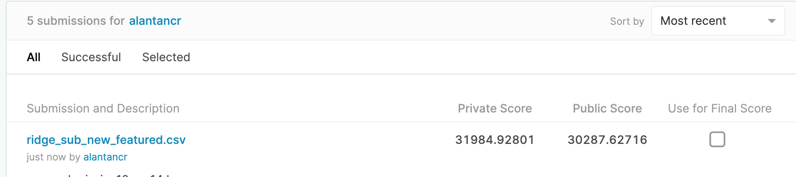

# Ames Housing Data and Kaggle Challenge

## Problem Statement

Our company was engagedby Real Estate company to conduct research and study on real estate opportunities in Iowa.

- To analyse the Ames Housing dataset from the Ames Accessor's Office containing information of residential properties sold in Ames (Iowa) from 2006 to 2010
- To develop a regression model to predict the sale price of houses
- To provide recommendation with insights for homeowners on what home improvement which will improve housing price

## Executive Summary

The aim of this report is to identify regression model which allow Real Estate company to make informed decision for their clients. This includes identifying features which allow home owners to make home improvement for better housing pricing. Data were provided by Kaggle for Iowa.

This report is defined into two section

- First part: Exploratory data analysis and Feature Engineering

  - Removing data outliers
  - Identifiying correlation via heatmap and factor
  - Feature engineering
    - combining and dropping variables

- Second Part: Modelling and Conclusion

  - Training modelling via linear, lasso and ridge regression

  - Comparing model based on adjusted R2 

  - Performing filter feature selection based on top 20 coefficient

    

## Limitation

Further exploration could be performed on the modelling (e.g. Recursive Feature Eliminiating or using hyperparamter tuning Gridsearch)

## Conclusion

The model was trained using Ridge regression with filtering top 20 features. There are few features which are identified as highly correlated to sales price of the house. One of the key feature is total surface area, it is noted that as the surface area of the housing increase, the unit price of the housing increases. Another important feature of housing sale price is the location of the neighborhood. It was identified that housing around neighbourhood Northridge and Stone Brook  will likely to see better housing sale price. 

## Data Dictionary

[Data Dictionary]() 

